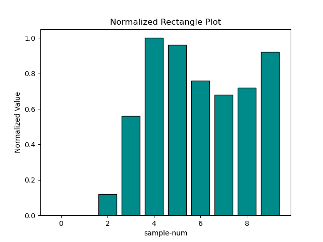

# Result-for-Anime-face-generation-with-Diffusion-Model

这是其结果说明


## Environment

```txt
Pytorch	2.5.1
Python  3.12(ubuntu22.04)
Cuda  	12.4
GPU		RTX 4090D(24GB) * 1
CPU		16 vCPU Intel(R) Xeon(R) Platinum 8481C
内存	   80GB
硬盘	   系统盘:30 GB
```


## Process

 

 

 

 

 

可以看到，生成的图像从模糊渐渐变为为有板有眼，同时动漫人物的人脸渐渐变为对称真实。


## Evaluation

我们这里不用上传的平台测试，而是在网上的某个以动漫图像识别番剧在线平台测试，[该平台]([AnimeTrace-以图识番-在线AI识番引擎|日漫识别|动漫查询|动漫基因库](https://ai.animedb.cn/en/)) 可以输出检测到的动漫头像数(无论有没有对应的剧名)，以上面的采样的结果为输入，测试其中每一张图的识别准确率：



这里实际上在第5次采样时就是可以达到最高的效果了。